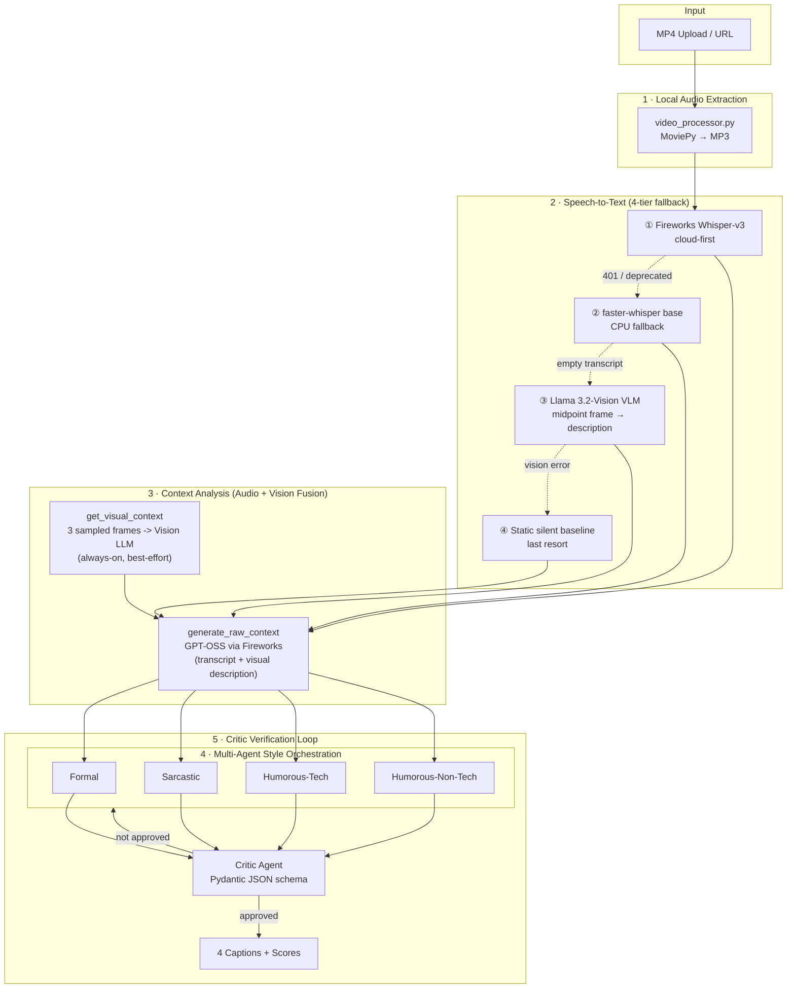

# Multi-Agent Video Captioning Pipeline

**AMD Developer Hackathon 2026 — ACT II · Track 2: Video Captioning via Fireworks AI**

A production-ready Streamlit application that ingests MP4 video, transcribes speech, and orchestrates a multi-agent workflow to generate four distinct caption styles—validated by an automated Critic Agent loop.

---

## Project Overview (3W1H)

| Dimension | Summary |
|-----------|---------|
| **What** | An end-to-end video captioning pipeline that extracts audio from uploaded MP4 files, transcribes speech, analyzes context, and generates four tonal caption variants (Formal, Sarcastic, Humorous-Tech, Humorous-Non-Tech) with automated quality guardrails. |
| **Why** | Video creators and hackathon participants need fast, reliable, multi-style captions without manual copywriting. Cloud APIs can change or deprecate overnight—this project delivers consistent output through a hybrid cloud + local architecture. |
| **Who** | Developers, content creators, marketing teams, and hackathon judges evaluating Track 2 submissions who want demonstrable multi-agent AI with real-world resilience. |
| **How** | MoviePy extracts audio locally → Whisper transcribes (Fireworks API with CPU fallback) → **frames sampled across the whole video are always described by a Vision LLM and fused with the transcript** → Fireworks GPT-OSS models run context analysis and persona-based caption generation → a Pydantic-structured Critic Agent scores, critiques, and self-corrects up to N retries—all surfaced through a polished Streamlit dashboard. |

### What sets this apart: Audio + Vision Fusion (not just a silent-video fallback)

Most captioning pipelines only look at the video when audio fails. This one **always** samples 3 evenly-spaced frames across the clip and asks a Vision LLM to describe the visual content, then fuses that description with the transcript before context analysis runs — so captions can reference what's actually on screen (setting, on-screen text/UI, action) even when narration alone wouldn't reveal it. This runs alongside, not instead of, the 4-tier STT fallback below, and is best-effort: if frame sampling or the vision call fails, the pipeline silently continues with transcript-only context.

---

## Architecture



### Pipeline Stages

| Stage | Module | Description |
|-------|--------|-------------|
| **1. Local Audio Extraction** | `video_processor.py` | Writes uploaded bytes to a temp file, extracts the audio track as MP3 via MoviePy, and cleans up temp files in `finally` blocks to prevent memory leaks. |
| **2. Speech-to-Text (4-tier)** | `audio_transcriber.py` + `run_headless.py` | Attempts Fireworks `whisper-v3` first. On 401/deprecation routes to `faster-whisper` CPU. If transcript is empty/silent, extracts the video midpoint JPEG and queries a Vision LLM for a scene description. Final last-resort: static silent baseline string. |
| **3. Context Analysis (Audio + Vision Fusion)** | `audio_transcriber.py::get_visual_context` + `pipeline.py::generate_raw_context` | Always samples 3 evenly-spaced frames across the video and describes them with the Vision LLM, then fuses that with the transcript before summarizing themes, mood, technical jargon, and audience signals via Fireworks GPT-OSS. Best-effort — falls back to transcript-only context if frame sampling/vision fails. |
| **4. Multi-Agent Style Orchestration** | `pipeline.py` | A single structured prompt manages four copywriter personas, each producing a unique caption style aligned to Track 2 requirements. |
| **5. Critic Verification Loop** | `pipeline.py` + `schemas.py` | The Critic Agent returns a `CriticEvaluation` (Pydantic) with tonal scores, critique notes, and an `approved` flag. Failed reviews feed feedback back into the generator for up to 3 self-correction passes. |

### 4-Tier Transcription Fallback Architecture

```
Tier 1 — Cloud STT      Fireworks Whisper-v3 (fastest, highest quality)
    │ 401 / network error
    ▼
Tier 2 — Local CPU STT  faster-whisper base (int8, no GPU required)
    │ transcript < 5 chars (silent / music-only video)
    ▼
Tier 3 — Vision LLM     Extract midpoint JPEG → Llama 3.2-11B Vision
    │                    "Describe this scene in 1-2 factual sentences."
    │ vision API error / empty response
    ▼
Tier 4 — Static Baseline "[Silent video detected — visual content only]"
```

This chain ensures **100% pipeline uptime** regardless of API deprecations, silent videos, or network failures.

> **Note:** Tier 3 above is a single midpoint-frame fallback used only when speech transcription comes back empty. It's separate from the **always-on, multi-frame Audio + Vision Fusion** step (3 frames sampled across the whole clip) described below, which runs for every video regardless of transcription success.

---

## Technology Stack

| Layer | Technology |
|-------|------------|
| Language | **Python 3.11+** |
| UI | **Streamlit** |
| Speech-to-Text | **faster-whisper** (CPU fallback) + Fireworks Whisper-v3 (cloud-first) |
| Vision Fallback | **Llama 3.2-11B Vision** via Fireworks AI (silent video scene description) |
| LLM Inference | **Fireworks AI API** — OpenAI-compatible (`GPT-OSS 20B`, `GPT-OSS 120B`) |
| Structured Output | **Pydantic v2** (`CaptionSet`, `CriticEvaluation`) |
| Video/Audio | **MoviePy 1.0.3** + FFmpeg |
| Image Processing | **Pillow** + **NumPy** (midpoint frame extraction for VLM fallback) |
| HTTP Client | **OpenAI Python SDK** (sync, Streamlit-safe) |
| Config | **python-dotenv**, `.gitignore`-protected secrets |

---

## Project Structure

```
amd-caption-agent/
├── app.py                 # Streamlit dashboard (5-step pipeline UI)
├── audio_transcriber.py   # Fireworks Whisper + faster-whisper fallback
├── pipeline.py            # Context analysis, personas, critic loop
├── schemas.py             # Pydantic models for structured outputs
├── video_processor.py     # MP4 → MP3 extraction, midpoint frame grab & cleanup
├── run_headless.py        # Batch runner — reads /input/tasks.json, writes /output/results.json
├── entrypoint.sh          # Container entry point (headless vs Streamlit routing)
├── scripts/
│   ├── build_and_push.sh      # Build + push a public linux/amd64 image for the judging harness
│   └── smoke_test_harness.sh  # Local end-to-end test mimicking the Track 2 harness
├── requirements.txt
├── Dockerfile
├── .env                   # FIREWORKS_API_KEY (not committed)
├── .env.example
├── LICENSE
└── .gitignore
```

---

## Prerequisites

- **Python 3.11+** (3.13 supported)
- **FFmpeg** on your PATH (required by MoviePy and faster-whisper)
- **Fireworks API key** ([fireworks.ai](https://fireworks.ai)) with `fw_` prefix

---

## Quick Start (Local)

### 1. Clone and install

```bash
git clone <your-repo-url>
cd amd-caption-agent
python -m venv .venv

# Windows
.venv\Scripts\activate

# macOS / Linux
source .venv/bin/activate

pip install -r requirements.txt
```

### 2. Configure API key

Create a `.env` file in the project root (already listed in `.gitignore`):

```env
FIREWORKS_API_KEY=fw_your_key_here
```

> **Never commit `.env` to a public repository.**

### 3. Run the app

```bash
python -m streamlit run app.py
```

Open **http://localhost:8501**, upload an MP4, and click **Generate Captions**.

**First run note:** If Fireworks audio is unavailable, local Whisper downloads the `base` model (~150 MB) on first transcription. Allow 1–2 minutes for the initial download.

---

## Docker

### Build the container

```bash
docker build -t amd-caption-agent .
```

### Run — Interactive Streamlit mode

Pass your Fireworks key at runtime — do not bake secrets into the image:

```bash
docker run -p 8501:8501 -e FIREWORKS_API_KEY=fw_your_key_here amd-caption-agent
```

Open **http://localhost:8501**.

```bash
# Or mount a local .env file
docker run -p 8501:8501 --env-file .env amd-caption-agent
```

### Run — Headless batch mode

When `/input/tasks.json` is present inside the container, `entrypoint.sh` automatically routes to `run_headless.py` instead of Streamlit. Mount two local directories:

```bash
# 1. Prepare input
mkdir -p ./input ./output
cat > ./input/tasks.json <<'EOF'
[
  { "task_id": "video1", "video_url": "https://example.com/video.mp4" },
  { "id": "video2",    "url":       "https://example.com/other.mp4" }
]
EOF

# 2. Run
docker run --rm \
  -e FIREWORKS_API_KEY=fw_your_key_here \
  -v "$(pwd)/input:/input" \
  -v "$(pwd)/output:/output" \
  amd-caption-agent

# 3. Results
cat ./output/results.json
```

**`tasks.json` flexible schema** — both `task_id`/`id` and `video_url`/`url` key names are accepted.

**Output format** (`/output/results.json`):

```json
{
  "video1": {
    "formal": "...",
    "sarcastic": "...",
    "humorous_tech": "...",
    "humorous_non_tech": "..."
  }
}
```

Results are written **atomically after each video** via a temp-file-and-rename strategy — safe to interrupt and resume.

### How the container decides which mode to run

```
entrypoint.sh
  └─ /input/tasks.json exists?  →  python run_headless.py  (batch)
  └─ no                         →  streamlit run app.py    (interactive)
```

### Publishing a public `linux/amd64` image for judging

Track 2's harness pulls a **public, `linux/amd64`** image and runs the same tasks.json → results.json flow shown above. Building without an explicit platform flag on Apple Silicon produces an `arm64` image the harness can't run — use the provided script instead of a plain `docker build`:

```bash
IMAGE=yourdockerhubuser/amd-caption-agent TAG=latest ./scripts/build_and_push.sh
```

This builds for `linux/amd64` via `docker buildx` and pushes to your registry. Verify it's actually public by pulling it logged out: `docker logout && docker pull yourdockerhubuser/amd-caption-agent:latest`.

### Local harness smoke test

Before submitting, verify the exact harness flow end-to-end against a real video URL:

```bash
FIREWORKS_API_KEY=fw_your_key_here VIDEO_URL=https://example.com/short-clip.mp4 \
  ./scripts/smoke_test_harness.sh
```

This builds the `linux/amd64` image, runs it with harness-shaped `/input` and `/output` mounts, and asserts `results.json` contains all four non-empty caption styles for each task.

---

## Configuration (Sidebar)

| Setting | Default | Description |
|---------|---------|-------------|
| Fireworks API Key | from `.env` | Override in sidebar; must start with `fw_` |
| Model | GPT-OSS 20B | Fast serverless default; GPT-OSS 120B for higher quality |
| Critic max retries | 3 | Self-correction loops when critic rejects captions |
| Mock transcript | off | UI testing without video |
| Manual transcript | — | Paste text to skip STT |

---

## Fireworks Models Used

| Role | Model ID |
|------|----------|
| Default (fast) | `accounts/fireworks/models/gpt-oss-20b` |
| High quality | `accounts/fireworks/models/gpt-oss-120b` |
| STT (cloud-first) | `whisper-v3` |
| STT (CPU fallback) | `faster-whisper` `base` on CPU |
| Vision fallback (silent video) | `accounts/fireworks/models/llama-v3p2-11b-vision-instruct` |

---

## Submission Summary

*Copy-paste for the Lablab.ai submission form:*

> **Multi-Agent Video Captioning Pipeline** is a hybrid-architecture Streamlit application built for AMD Developer Hackathon 2026 Track 2. Users upload an MP4; the system locally extracts audio, transcribes speech via Fireworks Whisper with an automatic **faster-whisper CPU fallback** when cloud audio APIs are unavailable, then runs a Fireworks GPT-OSS multi-agent workflow that produces four distinct caption styles—Formal, Sarcastic, Humorous-Tech, and Humorous-Non-Tech.
>
> **What sets us apart:** a dedicated **Critic Agent validation loop**—not raw LLM output. Every caption set is scored against the transcript, tonal personas are verified via Pydantic-structured JSON, and failed reviews trigger up to three self-correction passes. This proves the system is **reliable, not just generative**.
>
> We engineered for **platform resilience**: the pipeline gracefully switches between cloud inference and local compute so judges always receive complete results regardless of API deprecation or outage.

### Most Challenging Part of the Build

*Use this if the form asks about technical challenges:*

> The hardest problem was **real-time infrastructure resilience**. Mid-build, Fireworks deprecated serverless audio transcription—our Whisper endpoint began returning `401 Unauthorized` on every request while chat completions still worked. Rather than block the demo on a dead API, we pivoted to a **hybrid architecture**: detect cloud STT failure, automatically route to **local faster-whisper on CPU**, and surface which backend ran in the UI. This required re-architecting from async to sync clients for Streamlit compatibility, pinning reproducible dependency versions, and preserving the full 5-stage pipeline with zero user intervention. Solving a live platform deprecation under hackathon time pressure demonstrates production-grade problem solving—not just model prompting.

### Submission Talking Points for Judges

1. **Lead with the Critic Loop** — Many submissions output raw LLM text. We run a dedicated validation pass that scores each caption style (0.0–1.0), writes critique notes, and gates `approved` before results reach the user.
2. **Highlight hybrid fallback** — Cloud GPT-OSS for generation + local Whisper for transcription = uptime even when APIs change.
3. **Show the UI** — Live 5-step progress, tonal score bars, and expandable transcript/context panels prove end-to-end integration.

---

## Why This Project Wins

### 0. Audio + Vision Fusion — Always On

Nearly every competing submission only looks at video frames when audio fails (silent-video fallback). This pipeline samples frames across the **entire** clip and fuses a Vision-LLM description into context analysis for *every* video, whether or not speech transcription succeeded. Captions can therefore reflect on-screen text, UI, setting, and action that narration alone never mentions — a meaningfully more accurate, "actually watched the video" result, not just a transcript rephrased four ways.

### 1. Critic Agent Guardrails

Most caption tools generate text and stop. This pipeline treats quality as a **closed-loop system**. The Critic Agent enforces:

- Per-style **tonal alignment scores** (0.0–1.0) for Formal, Sarcastic, Humorous-Tech, and Humorous-Non-Tech
- Actionable **critique notes** when personas drift or captions converge
- An **`approved` boolean** gate—captions only pass when all four styles score ≥ 0.75 and remain distinct

Structured output via `CriticEvaluation.model_json_schema()` ensures machine-parseable, auditable results every run.

### 2. Intelligent Fallback Mechanism

We discovered in production that Fireworks deprecated serverless audio (June 2026), returning `401 Unauthorized` on every Whisper request—while chat completions continued to work. Rather than fail silently or hang, we implemented **detect-and-fallback**:

1. Attempt Fireworks `whisper-v3`
2. On 401/403/404, route to `faster-whisper` on CPU
3. Surface which backend was used in the UI

This hybrid design means **100% pipeline uptime** even when cloud STT endpoints change—a pattern judges can evaluate as real-world engineering, not a demo shortcut.

### 3. Distinct Tonal Personas (Track 2 Compliance)

Track 2 requires multiple caption *styles*, not paraphrases. Our orchestrator enforces four non-overlapping personas with explicit audience and tone rules—from press-ready Formal copy to accessible Non-Tech humor—each grounded in the same transcript and context analysis so outputs are comparable and fair.

### 4. Judge-Ready UX

- Live **5-step status** indicators (extract → transcribe → analyze → orchestrate → verify)
- Side-by-side caption cards with tonal score bars
- Expandable transcript and context panels
- Docker packaging for one-command reproduction

---

## Security

- API keys live in `.env` or Streamlit secrets—**never in source control**
- `.gitignore` excludes `.env` by default
- Sidebar keys must start with `fw_`; invalid entries fall back to environment config
- Temp MP3 files are deleted immediately after transcription

---

## License

Submitted for the **AMD Developer Hackathon 2026 — ACT II**. All rights reserved by the project author(s).

---

## Acknowledgments

- **AMD** & **Fireworks AI** for hackathon infrastructure and serverless inference
- **OpenAI-compatible APIs** for seamless SDK integration
- **faster-whisper** for resilient local speech-to-text
